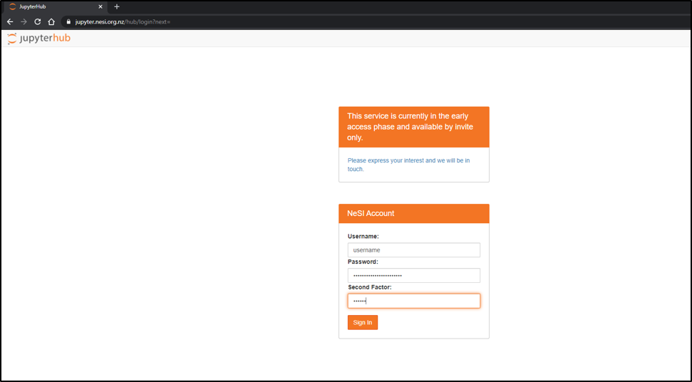

>**WARNING**- We **do not recommend** using Internet Explorer to accss [NeSI JupyterHub](https://jupyter.nesi.org.nz/hub/login)

1. Follow https://jupyter.nesi.org.nz/hub/login
2. 
Enter NeSI username, HPC password and 6 digit second factor token 

3. 
Choose server options as below OR as required for the session
>Project code should be **nesi99991** (select from drop down list), Number of CPUs and memory size can remain unchanged. However, select the approriate **Wall time** based on the projected length of a session

 

